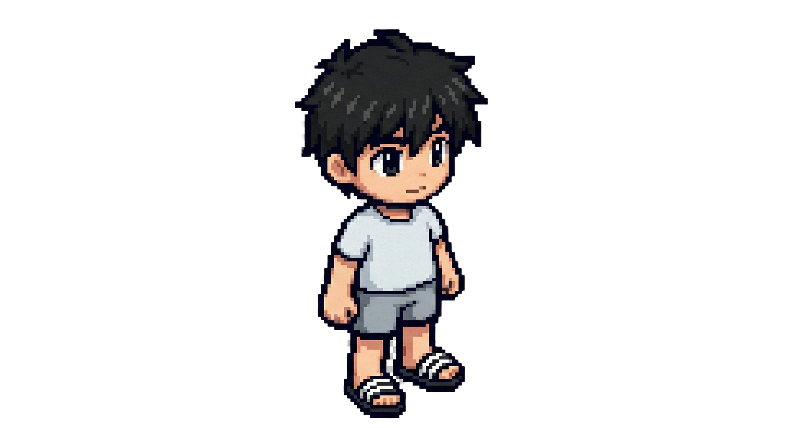

# Pixel Lab (v12.0)
**Focus Timer & Pixel Art Collection**

> "Just 5 minutes. Start your flow with pixel art."

**Pixel Lab** is a gamified focus timer designed to help you enter "Deep Work" states effortlessly.
By focusing, you earn points to collect high-quality pixel art characters and backgrounds.

## ✨ Key Features

### 1. ⏱️ Gamified Timer
- **5-Minute Warm-up**: Start lightly. Deep Work mode activates after 5 minutes.
- **Deep Work Mode**: Get immersed with dimmed backgrounds and focused UI.
- **Visual Feedback**: The timer ignites when you are in the zone.

### 2. 📊 Analytics & Chart
- **Weekly Activity**: Track your daily focus time with a beautiful bar chart.
- **History Tracking**: Automatically records your sessions.
- **Data Backup**: Export/Import your data safely to JSON.

### 3. 🎨 Collection & Gacha
- **Gacha System**: Spend points to unlock new Skins and Backgrounds.
- **Pity System**: Bad luck protection ensures you get new items eventually.
- **Customization**: Decorate your timer with your favorite pixel art.

### 4. 🔊 Sound Effects (SFX)
- **Satisfying Clicks**: Crisp UI sounds.
- **Deep Work Alert**: Soft notification when entering deep focus.
- **Sound Toggle**: Option to mute for silent environments.

---

## 🛠️ How to Run
This project consists of static files (`HTML`, `CSS`, `JS`).
You can run it directly in any modern browser.

### Local Development
1. Clone the repo.
2. Open `index.html` in Chrome/Edge.
3. (Optional) Run `python app.py` to serve on `localhost:8080`.

### Deployment
This project is ready for **GitHub Pages**.
Simply push the code and enable Pages in repository settings.

---

## 📜 Version History
- **v12.0**: Visual Polish (Animations, Dimming), Cache Busting
- **v11.3**: Data Backup & Restore
- **v11.2**: Weekly Activity Chart (Canvas)
- **v11.1**: Sound Effects (Web Audio API)
- **v10.x**: Core Economy, Stability, Safe Mode

---
*Created with Google DeepMind Agentic Coding*
